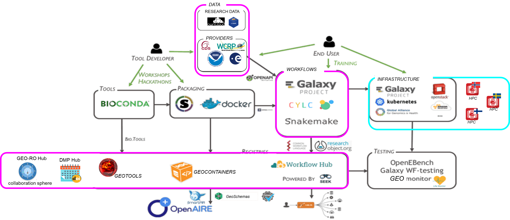

# Nordic Climate Community and EOSC

EOSC Nordic activities and synergies with other EOSC projects such as EOSC-Life and EOSC-Pillar.

In this working document, we try to identify areas where EOSC-Nordic and the Nordic Climate Community could collaborate with other EOSC related projects to fotser and advance take-up of of the European Open Science Cloud.

## EOSC-Nordic Climate Science demonstrator

For reference, we add a [link to the Climate Science use cases](https://nordicesmhub.github.io/eosc-nordic-climate-demonstrator/) defined within EOSC-Nordic Climate Science demonstrator.

## Roadmaps

### EOSC-Life tool roadmap

*Reference*: [https://github.com/eosc-life/tools-collaboratory-roadmap](https://github.com/eosc-life/tools-collaboratory-roadmap)

### EOSC-Nordic tool roadmap for the Climate community

Rather than reinventing the wheel, EOSC-Nordic chose to base its roadmap on the [EOSC-Life tools roadmap](https://github.com/eosc-life/tools-collaboratory-roadmap) and reuse as many components as possible for the Climate community. Strengthening collaboration with Galaxy Community and EOSC-Life is an integral part of its plan.

## Data

## Workflows

## Infrastructure

## Registries

